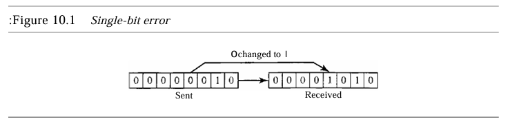

<section>
  <h1>Detección y Corrección de Errores</h1>
  <h2>Capítulo 10</h2>
  
JUAN MIGUEL LEON CUPUL

</section>

<section>
  <h2>Introducción a los Errores.</h2>
  
La transmisión de datos en redes debe garantizar la integridad de la información envida. Los errores pueden ocurrir debido a interferencias, y existen métodos para detectarlos y corregirlos.

  

    
  

</section>

<section>
  <h2>Tipos de Errores</h2>
  <ul>
    <li><strong>Error de un solo bit</strong>: Cambia solo un bit del mensaje.</li>
    <li><strong>Error en ráfaga</strong>: Afecta dos o más bits del mensaje.</li>
  </ul>
  

    
  

</section>

<section>
  <h2>Corrección vs. Detección de Errores</h2>
  
Detectar errores es más sencillo que corregirlos. En la detección, solo se busca saber si ocurrió un error. La corrección requiere identificar la ubicación específica de los errores.

</section>

<section>
  <h2>Métodos de Corrección de Errores</h2>
  <ul>
    <li><strong>Corrección de errores hacia adelante</strong>: El receptor intenta reconstruir el mensaje usando bits redundantes.</li>
    <li><strong>Retransmisión</strong>: El receptor detecta el error y solicita el reenvío del mensaje.</li>
  </ul>
</section>

<section>
  <h2>Códigos de Bloque y Códigos Cíclicos</h2>
  
La redundancia se logra mediante esquemas de codificación como códigos de bloque y códigos cíclicos. Los códigos de bloque dividen el mensaje en bloques, añadiendo bits redundantes para la detección y corrección de errores.

  

    
  

</section>

<section>
  <h2>Código de Paridad Simple</h2>
  
Este código permite la detección de un solo error en un bloque de datos. Se utiliza un bit de paridad para asegurar que el número total de bits sea par.

  

    
  

</section>

<section>
  <h2>Códigos de Hamming</h2>
  
Los códigos de Hamming permiten detectar hasta dos errores y corregir uno solo. Son utilizados cuando la precisión es crítica en la transmisión de datos.

  

    
  

</section>

<section>
  <h2>Código de Redundancia Cíclica (CRC)</h2>
  
Los CRC son códigos especiales que permiten detectar errores mediante operaciones polinómicas, garantizando una alta precisión en la detección.

  

    
  

</section>

<section>
  <h2>Resumen</h2>
  <ul>
    <li>Los errores pueden ser de un solo bit o en ráfaga.</li>
    <li>La detección es más sencilla que la corrección.</li>
    <li>Existen varios métodos de corrección de errores, como los códigos de paridad, de Hamming y CRC.</li>
   </ul>
 </section>