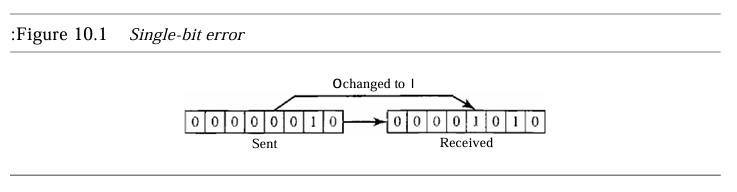
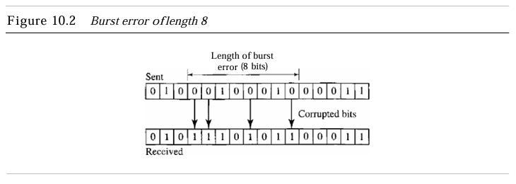
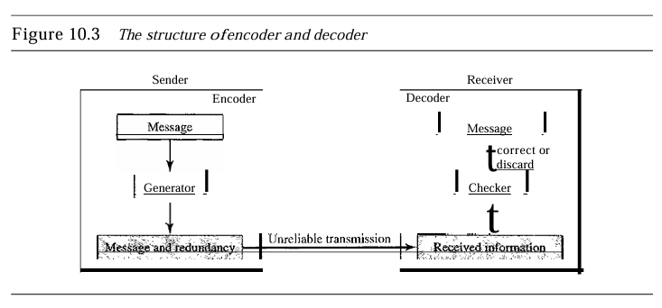
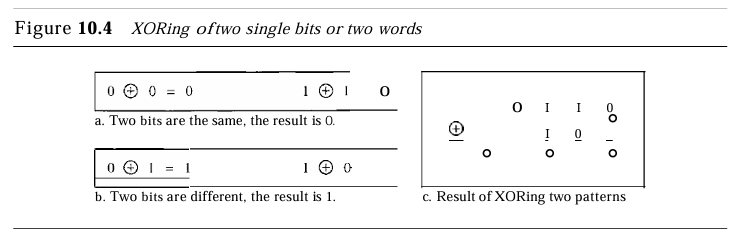
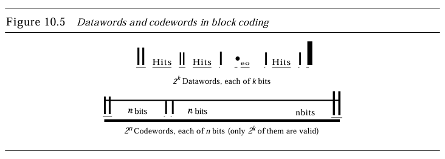
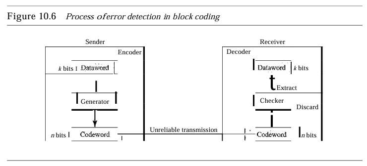
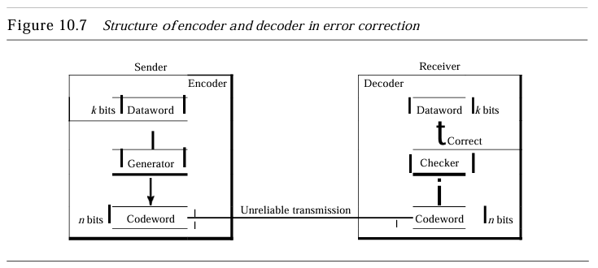

 <section>
  <h1>Detección y Corrección de Errores</h1>
  <h2>Capítulo 10</h2>
  
JUAN MIGUEL LEON CUPUL

 </section>

<section>
  <h2>Introducción a los Errores</h2>
  
En la transmisión de datos a través de redes, es esencial asegurar que los datos lleguen al destino sin alteraciones. Los errores pueden ocurrir por interferencias y otros factores externos. Para garantizar la precisión, los sistemas de comunicación implementan mecanismos de detección y corrección de errores.

  

    
  

</section>

<section>
  <h2>Tipos de Errores</h2>
  <ul>
    <li><strong>Error de un solo bit</strong>: Afecta solo un bit en la transmisión, lo que es raro debido a la duración mínima de los pulsos de ruido necesarios para alterar un solo bit.</li>
    <li><strong>Error en ráfaga</strong>: Implica el cambio de múltiples bits en una unidad de datos, siendo más común que el error de un solo bit.</li>
  </ul>
  

    
  

</section>

<section>
  <h2>Redundancia</h2>
  
La redundancia es clave para la detección y corrección de errores. Consiste en agregar bits adicionales al mensaje para verificar o corregir posibles errores en la recepción. Estos bits redundantes se agregan al mensaje por el emisor y se eliminan una vez verificada su integridad en el receptor.

</section>

<section>
  <h2>Detección vs. Corrección de Errores</h2>
  
Detectar errores es más sencillo que corregirlos. La detección se enfoca en identificar si hubo un error, sin importar la cantidad o posición de los bits afectados. En la corrección, se requiere identificar los bits específicos que fueron alterados, lo cual es más complejo.

</section>

<section>
  <h2>Métodos de Corrección de Errores</h2>
  <ul>
    <li><strong>Corrección hacia adelante (FEC)</strong>: El receptor utiliza bits redundantes para reconstruir el mensaje, especialmente cuando el número de errores es bajo.</li>
    <li><strong>Retransmisión</strong>: Si se detecta un error, el receptor solicita que el mensaje se reenvíe hasta que llegue sin errores.</li>
  </ul>
</section>

<section>
  <h2>Códigos de Bloque y Códigos Cíclicos</h2>
  
Los códigos de bloque dividen el mensaje en bloques de datos, a los que se agregan bits redundantes para facilitar la detección y corrección de errores. Los códigos cíclicos, como el CRC, son un tipo especial de códigos de bloque que permite rotar los bits para mejorar la eficiencia de la corrección de errores.

  

    
  

</section>

<section>
  <h2>Código de Paridad Simple</h2>
  
El código de paridad simple agrega un bit de paridad a cada bloque de datos, asegurando que el número total de bits sea par (o impar, según el caso). Es una forma básica de detección de errores que permite identificar errores de un solo bit, pero no puede corregirlos.

  

    
  

</section>

<section>
  <h2>Códigos de Hamming</h2>
  
Los códigos de Hamming, desarrollados por Richard Hamming, son capaces de detectar hasta dos errores y corregir uno solo. Utilizan una estructura de paridad que asigna bits de verificación en posiciones estratégicas dentro de los bloques de datos. Estos códigos son útiles en aplicaciones que requieren precisión, como en la transmisión de datos sensibles.

  

    
  

</section>

<section>
  <h2>Distancia de Hamming</h2>
  
La distancia de Hamming es una métrica que mide la cantidad de bits diferentes entre dos palabras de igual longitud. En la codificación de errores, esta distancia es crucial para determinar cuántos errores pueden detectarse o corregirse en un bloque de datos. Para detectar errores de hasta s bits, la distancia mínima de Hamming debe ser s + 1.

  

    
  

</section>

<section>
  <h2>Código de Redundancia Cíclica (CRC)</h2>
  
El CRC utiliza operaciones polinómicas para detectar errores en bloques de datos. Cada mensaje es tratado como un polinomio, y los bits redundantes se generan dividiendo este polinomio por un divisor predefinido. El CRC es ampliamente utilizado en redes LAN y WAN, debido a su eficiencia en la detección de errores.

  
</section>

<section>

    
  

</section>

<section>
  <h2>Aritmética Modular</h2>
  
La aritmética modular es la base de muchas operaciones en los códigos de corrección de errores. En particular, el cálculo de CRC depende de la división en módulo-2, donde las operaciones de suma y resta se realizan usando la operación XOR. Este método asegura que las operaciones en bits sean eficientes y minimicen errores.

</section>

<section>
  <h2>Códigos Lineales de Bloque</h2>
  
La mayoría de los códigos de corrección de errores modernos son lineales, donde el XOR de dos palabras válidas genera otra palabra válida. Esto simplifica las implementaciones y permite realizar codificaciones y decodificaciones de manera más eficiente.

</section>

<section>
  <h2>Resumen</h2>
  <ul>
    <li>Los errores en la transmisión de datos pueden ser de un solo bit o en ráfaga, con los errores en ráfaga siendo más comunes.</li>
    <li>La detección es generalmente más sencilla que la corrección, ya que esta última requiere ubicar los errores específicos.</li>
    <li>Existen varios métodos para la corrección de errores, entre ellos la paridad simple, los códigos de Hamming y los CRC.</li>
    <li>La distancia de Hamming es un concepto clave que determina la capacidad de los códigos para detectar y corregir errores.</li>
    <li>El CRC es un método avanzado que utiliza aritmética modular para detectar errores de manera eficaz, comúnmente usado en redes.</li>
  </ul>
</section>
